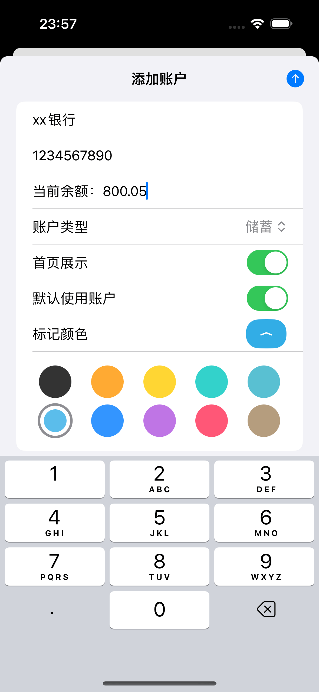
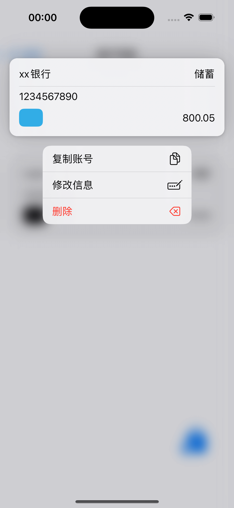
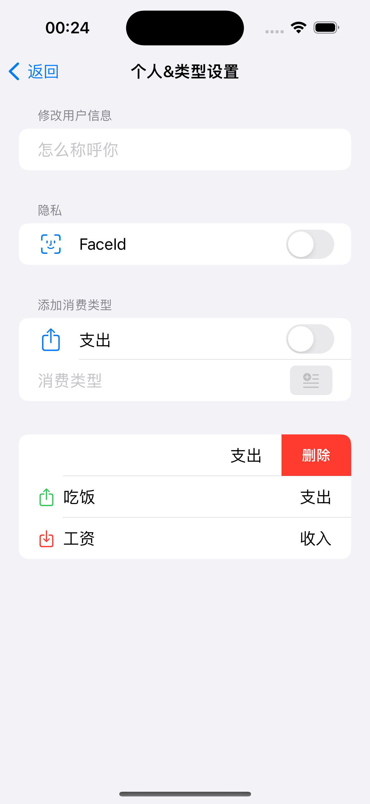
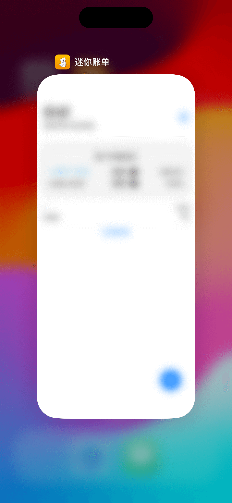
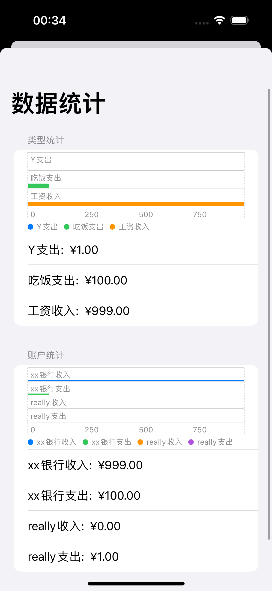
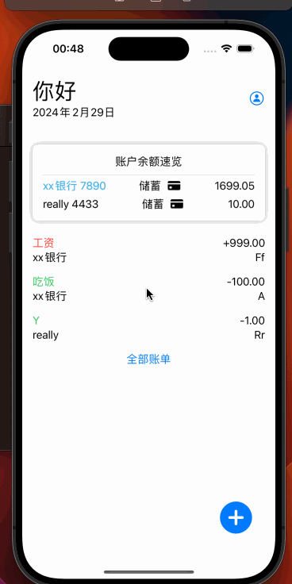

# 迷你账单
一个简单的记账工具  

-----
开发环境：xcode 15.2  
编译sdk： iOS 17  
最低运行系统版本：iOS 16.4
---

-----
*开发这个软件的目的：因为一位朋友的委托，同时我对iOS的开发十分好奇，于是抱着学习的目的开发这这个小工具。*   
*鉴于市面上的记账工具太多了，但是他们大多需要登陆帐号，把个人的数据同步到服务器中，内购广告，过多的索要权限等……*  
  *~~此软件只需要Face Id权限（当用户在App内打开Face Id锁定功能时~~，无需联网，无需注册帐号登陆，无内置广告*  
 *源所有页面以及逻辑代码给需要的人使用*  

 <u>设置1元下载费是为了收回购买开发者帐号的费用</u>  

---  

## 软件说明  
实现的功能如下  
1. 账户管理（增删改查）
2. 消费类型管理（增删改查，拖动排序）
3. 账单管理（增删改查）
4.  ~~Face Id锁定App~~ (不符合隐私政策)
5. 账单备注信息搜索
6. 账单日期搜索
7. 搜索结果统计（SwiftUI Charts）
8. App切换后台毛玻璃效果
9. App国际化（文本+App名称修改）

-------
## 部分功能的截图  
* 添加账户  
  
* 账户列表长按编辑  

* 消费类型管理（滑动删除&点击编辑&长按排序）
  
* 切换后台毛玻璃效果  
  
* 数据统计柱状图（饼图无法在 iOS 17以下版本实用）
  

Simulator Screenshot - iPhone 15 Pro  

* 效果展示  

--------
